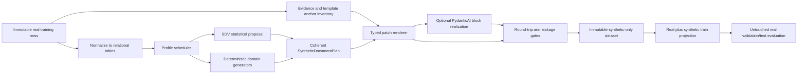

# KIE synthetic-data and decoder-training research board

Date: 2026-08-29

Status: research complete; decoder runtime and lossless synthesis foundation implemented; synthetic
mutation/rendering policy remains gated

Implementation trace:
[`docs/kie-decoder-and-synthesis-implementation.md`](kie-decoder-and-synthesis-implementation.md)

## Purpose

This board defines two independent extension tracks for the bill-of-lading KIE program:

1. a provenance-preserving structured-data synthesis and raw-OCR augmentation pipeline built around
   Synthetic Data Vault (SDV), deterministic domain generators, and narrowly scoped PydanticAI
   agents; and
2. a decoder-only fine-tuning environment for Qwen3.5 0.8B, with Qwen3 0.6B as a causal-LM
   control, supporting supervised fine-tuning (SFT), LoRA, GRPO, and Dr. GRPO through Unsloth and
   TRL.

The tracks share dataset contracts, task validation, evaluation semantics, provenance conventions,
and MLflow reporting. They do **not** share a training runtime or have to be implemented together.
This separation is deliberate: synthetic-data quality must be established independently of a model
architecture change, and the decoder model must be benchmarked on real data before synthetic data is
introduced.

## Executive decisions

### Fixed for both tracks

- The current 1,157-record task-facing dataset is an immutable source. Every normalization,
  synthesis, prompt conversion, or train/eval partition is a separately published projection with
  source hashes and row-level lineage.
- The current task-facing Pydantic target remains the semantic authority. Synthetic records must
  validate as `BillOfLadingRelationExplicitLabel`; a model-specific serialization may be projected
  from it but may not redefine its meaning.
- Raw OCR and target JSON must change together. A synthetic label without matching synthetic text,
  or synthetic text whose emitted values do not round-trip to its target, is rejected.
- Real validation and test documents are never used as synthetic templates. Split real source
  documents first, synthesize from the training partition only, and bind every variant to its base
  document and template family.
- Evaluation remains unconstrained generation. JSON/schema-constrained decoding may be used later
  for serving, but it is not allowed to conceal what either trained model has learned.
- All configuration is strict YAML validated by Pydantic. Unknown keys, unsupported combinations,
  missing hashes, and unmeasured truncation are errors rather than fallbacks.
- The existing MLflow service and exact field/value, cargo-relation, and categorical metrics remain
  the cross-model comparison contract.

### Fixed for synthesis track A

- Version 1 is **cardinality-preserving**: it may replace values and coherent repeated blocks, but it
  does not invent additional cargo rows, containers, parties, or pages. Adding/removing repeated
  structures is a later, separately validated renderer capability.
- A raw-text “diff” is a typed, occurrence-aware patch plan—not global string replacement and not an
  unconstrained LLM rewrite of the entire document.
- SDV learns distributions and correlations; deterministic code owns formal identifiers, arithmetic,
  registries, chronology, relation integrity, and rendering. PydanticAI owns only genuinely
  linguistic or ambiguous block-realization work.
- SDV Community is the assumed dependency. The design does not depend on Enterprise-only
  multi-table conditional sampling, HSA, IndependentSynthesizer, or multi-table CAG.
- “Synthetic” does not automatically mean “anonymous.” Privacy/leakage checks are an independent
  acceptance gate.

### Fixed for decoder track B

- `Qwen/Qwen3.5-0.8B` post-trained is the preferred first candidate. It supports text-only use and
  task-specific fine-tuning, but it is technically a unified vision-language checkpoint with a
  hybrid language backbone. Its loader and kernels must follow the Qwen3.5-specific Unsloth path.
- `Qwen/Qwen3-0.6B` post-trained is the required conventional causal-LM control. A Qwen3.5 result is
  not interpretable without this lower-complexity control.
- Decoder training gets its own uv lock, Docker image, Compose service, CLI, and artifact namespace.
  The current T5Gemma seq2seq runtime remains unchanged.
- SFT with completion-only loss is the first stage. GRPO/Dr. GRPO starts from a successful SFT
  checkpoint, not from an unadapted base model.
- The default RL reward is deterministic and label-derived. Invalid JSON or schema receives zero;
  valid outputs receive task F1. This strict gate is enabled only after a readiness probe proves the
  SFT policy produces enough schema-valid, reward-diverse samples.
- “Reasoning before output” is an experiment, not an assumption. Direct JSON, auditable
  evidence-plan reasoning, and native thinking must be compared for F1, termination, latency, and
  output length. Hidden, unverified chain-of-thought is not manufactured as ground truth.

## Current repository boundary

### Assets to reuse

| Existing component | Reuse in synthesis | Reuse in decoder training |
|---|---|---|
| `src/document_ocr/label_schemas/bill_of_lading_v3.py` | Final target and relation invariants | Final target, schema validation, canonicalization |
| `src/document_ocr/training/tasks.py` | Task registry and canonical JSON | Prompt schema, validator, canonical target |
| `src/document_ocr/training/metrics.py` | TSTR/downstream utility metrics | SFT/GRPO evaluation and reward primitives |
| `src/document_ocr/training/splitting.py` | Source-group-aware partitioning seam | Seeded split and immutable partition report |
| `src/document_ocr/training/data.py` | Dataset identity and row validation | Dataset identity and row validation |
| `src/document_ocr/labeling_agents/provider.py` | Structured PydanticAI calls, limits, usage, transcripts, pricing | Not part of GPU training; reusable only for optional offline rationale generation |
| Labeling receipts and evidence sidecars | Source anchoring and patch evidence | Optional auditable reasoning supervision |
| MLflow conventions in `training/runtime.py` | Synthesis experiment summaries, not model weights | Training, eval, system metrics, artifacts |

### Boundaries that should not be widened

The current training configuration accepts only `architecture: seq2seq_lm` and
`objective: seq2seq_teacher_forcing`. Runtime loading is hard-wired to
`AutoModelForSeq2SeqLM`, and PEFT uses `TaskType.SEQ_2_SEQ_LM`. Adding causal SFT and online RL as a
large conditional branch would make configuration and lifecycle behavior difficult to reason about.
The decoder stack should therefore be a sibling package, not a compatibility layer inside the T5
runtime.

Likewise, the labeling orchestrator is specialized for raw-OCR label adjudication. The synthesis
implementation should extract its well-tested provider/receipt primitives into a small shared
gateway only when concrete reuse requires it; it should not repurpose the label-review state machine
as a synthetic renderer.

### Dataset facts that drive the plan

The current source is:

```text
artifacts/kie-training/datasets/
  mpci-bl-combined1157-task-facing-package-categories-v2/
    records.jsonl
    lineage.jsonl
    category-metadata.jsonl
    task-constraints.json
    manifest.json
```

Each record contains `documentId`, `joinedRawText`, `joinedRawTextSha256`, `normalTarget`, and
`target`. The target separates cargo groups, package facts, containers, and allocation groups, while
Pydantic validators enforce local identities, reference integrity, source ordering, coverage shape,
and quantity reconciliation.

The latest broad EDA is from the preceding 1,109-record snapshot and must be refreshed before quotas
are frozen. It nevertheless identifies the right initial pressure points: dangerous goods were 2.9%,
temperature settings 4.0%, forwarding agents 7.3%, and multiple goods groups 6.4%; ordinary
one-goods/one-container documents dominated. The latest consolidated model audit independently finds
that repeated cargo hierarchy, omissions, long party addresses, marks, and allocations—not ordinary
scalar copying—dominate the remaining error budget. These are the cohorts synthesis should target.

---

# Track A — structured synthesis and raw-OCR augmentation

## A1. Objective and truth contract

Given a real training document `(raw OCR, structured target, evidence, provenance)`, produce one or
more variants that:

1. remain a plausible bill of lading, sea waybill, or equivalent maritime transport document;
2. preserve the base document's template grammar and field presentation;
3. replace real facts with coherent synthetic facts;
4. carry a target that is exactly supported by the resulting synthetic OCR text;
5. intentionally improve a requested dataset cohort or distribution; and
6. can be traced to a source dataset, base document, synthesizer state, random seed, mutation plan,
   renderer, validators, agent calls, and publication manifest.

“Semantically equivalent” should mean **the same document class, template capability, and relation
topology**, not identical cargo semantics. Turning a dry ordinary shipment into reefer or dangerous
goods changes the document subtype and requires fields the template may not contain. Such changes are
valid only for templates explicitly proven to support them.

## A2. Proposed data flow



The statistical proposal is not publishable data. Only a fully rendered and validated document plan
becomes a training record.

## A3. Relational training view for SDV

The nested JSON target should first be normalized into explicit tables. The normalized form is a
modeling intermediate and does not replace the task schema.

| Table | Key and important columns | Parent |
|---|---|---|
| `documents` | synthetic document ID, base/template ID, carrier family, document type, counts, feature flags | — |
| `document_facts` | dates, freight, negotiability, issue place, vessel/voyage, route fields | document |
| `parties` | role, occurrence index, name/address/city/country/contact-presence | document |
| `containers` | local container ID, size/type family, seals, VGM, reefer/temperature flags | document |
| `cargo_groups` | local group ID, description class, HS/DG/origin flags, weights, volume, marks presence | document |
| `cargo_packages` | local package ID, group ID, quantity, readable category, hierarchy role sidecar | cargo group |
| `allocations` | group/package/container edges, coverage, allocated quantity | document plus referenced children |
| `dangerous_goods` | group ID, UN number, hazard category, subsidiary hazard, flash point, packing group | cargo group |

This graph is deeper and more relational than SDV Community's recommended HMA envelope. The public
HMA synthesizer is intended for a small hierarchy (documentation describes up to roughly five tables
and depth one), while public multi-table conditional sampling is not available. The implementation
should therefore benchmark, not assume, one of these strategies:

1. **Recommended first:** a single-table document-scenario model plus per-entity/table models,
   coordinated by deterministic dependency code. Use SDV for within-table distributions and
   correlations, then rebuild identities and relations explicitly.
2. **HMA ablation:** a simplified depth-one view such as documents → parties/containers/cargo/package
   summary, with allocations reconstructed deterministically. Keep only if quality and target-cohort
   control are better than the layered approach.
3. **Profile-specific models:** fit separate models for sufficiently supported cohorts/templates when
   a global conditional sampler cannot reliably reach rare conditions. Fail when support is below a
   configured minimum instead of silently sampling the common distribution.

`GaussianCopulaSynthesizer` is the first single-table baseline because SDV recommends it for speed,
customization, and mathematical conditional sampling. CTGAN and TVAE are benchmark arms only; the
dataset is small, high-cardinality text is not their job, and neural conditional sampling may rely on
expensive rejection. Model selection is empirical per table/profile, not one synthesizer for every
field.

## A4. Dependency graph and generation ownership

The generation order must encode real dependencies:

```text
target profile
  -> eligible base template and carrier/template family
  -> document type and route lane
  -> route ports/countries and party locality context
  -> transport/freight/date chronology
  -> cargo archetype and goods description
  -> HS / dangerous-goods / handling facts
  -> package hierarchy, quantities, weights, volume
  -> container count/type/reefer settings
  -> cargo-package-container allocations
  -> surface formatting inherited from the base template
```

| Field family | Primary generator | Required checks |
|---|---|---|
| Document-local IDs (`g1`, `p1`) | Deterministic | contiguous source order and reference integrity |
| Container numbers | Deterministic ISO 6346 generator | owner/category/serial syntax, check digit, uniqueness |
| Seal and booking-like identifiers | Deterministic pattern generator learned from template surface | uniqueness, no retained real identifier, presentation pattern |
| Countries, ports, localities | Versioned reference registry plus sampled lane | valid port-country relation; keep printed text target policy |
| Dates | Deterministic chronology plus base format profile | semantic order, valid calendar dates, identical source presentation style |
| Quantities, net/gross weights, volume | Statistical proposal plus deterministic arithmetic | non-negative; gross ≥ net; allocation and package reconciliation |
| Package categories | SDV categorical proposal constrained to frozen readable registry | supported category, template/cargo compatibility |
| Container family and temperature | Scenario model plus deterministic compatibility rules | reefer implies supported type/template and coherent temperature facts |
| HS and UN/DG facts | Authoritative registry sampler | code validity and coherent hazard/packing attributes |
| Party names/addresses/contacts | Locale-aware synthetic providers, optionally SDV for shapes | no real PII, country/locality consistency, format preservation |
| Goods descriptions | PydanticAI or curated generative provider conditioned on cargo facts | consistent with HS/DG/package facts; no copied real party/identifier text |
| Cargo/marks/handling prose | Deterministic templates first; PydanticAI only when linguistic variation is needed | target inclusion boundary and no unsupported claims |
| Relations and allocation coverage | Deterministic graph builder | all current Pydantic relation invariants and exact sums |

An external registry is not accepted merely because a value looks valid. Every registry must carry
authority, version/revision, source path, SHA-256, and a deterministic canonicalization policy.

## A5. Template and evidence inventory

Before synthesis, create an immutable inventory for every eligible real training row:

- template-family ID and confidence/source;
- raw OCR and target hashes;
- page boundaries and repeated header/footer regions;
- field evidence anchors with page, start/end offsets, raw value, normalized target value, nearby
  prefix/suffix, and all role-equivalent occurrences;
- presentation profiles for dates, decimal separators, thousands separators, units, casing, spacing,
  line breaks, and identifier punctuation;
- repeated-block capabilities for parties, containers, cargo rows, marks, and totals;
- supported semantic capabilities such as reefer, dangerous goods, multiple cargo, multiple package
  levels, and container allocations; and
- unresolved or non-unique anchors, which make that field/template ineligible for automatic patching.

This inventory cannot be built by matching normalized labels blindly. Dates and readable categories
may differ from printed OCR; a value may occur on several pages; and the same string may appear in an
unrelated role. Prefer existing annotation evidence. Use deterministic exact/normalized matching
only where it yields a unique role-aware mapping. A PydanticAI anchoring call is allowed only for the
remaining bounded block and must return structured spans and evidence, never a rewritten document.

## A6. Typed mutation and rendering contract

Proposed Pydantic contracts:

```text
SynthesisTargetProfile
  profile_id
  requested_count
  cohort predicates and quotas
  eligible template families
  cardinality policy
  maximum variants per real source

SyntheticDocumentPlan
  synthetic_document_id
  base_document_id / base hashes
  target profile and random seeds
  generated normalized tables
  projected BillOfLadingRelationExplicitLabel
  field mutations[]
  block mutations[]

FieldMutation
  semantic field path
  source anchor group
  old raw value / new raw value
  old normalized value / new normalized value
  presentation formatter and version

BlockMutation
  block kind and exact source span
  replacement block
  field-to-subspan map
  deterministic or agent renderer receipt
```

Renderer rules:

1. Verify the base row and inventory hashes immediately before rendering.
2. Apply non-overlapping mutations from the end of text toward the beginning.
3. Replace all and only role-equivalent repeated occurrences.
4. Preserve the template's field labels, ordering, separators, units, and line conventions.
5. Recompute totals and cross-references from normalized synthetic facts, never by textual arithmetic.
6. Reject overlapping, missing, stale, non-unique, or unexpectedly repeated anchors.
7. Parse the projected target through the current Pydantic task validator.
8. Verify every target leaf is supported by the rendered text under the same normalization policy used
   for real labeling.
9. Verify removed real target values and sensitive identifiers no longer survive in role-equivalent
   text locations.

Global `str.replace` is forbidden. A full-document LLM rewrite is also forbidden: it is expensive,
destroys template fidelity, and makes exact source/target agreement difficult to prove.

## A7. Cardinality-preserving v1 versus expandable v2

### Version 1: replacement only

- Preserve party, container, cargo-group, package, and allocation counts.
- Preserve relation topology and allocation coverage class.
- Change values, categories, routes, descriptions, quantities, weights, and identifiers only where
  the template capability permits it.
- This version can rebalance many fields and carrier/template variants without solving layout
  expansion.

### Version 2: repeated-block expansion

Adding a cargo line or container is not a field diff. It requires a proven repeatable block, new
local IDs, reflowed totals, possible page continuation, and consistent allocations. Enable it only
for templates whose inventory identifies:

- an exact repeat-unit span;
- insertion location and separator grammar;
- a supported row/space or continuation policy;
- total/summary fields that must be recomputed; and
- a deterministic way to anchor every new target fact.

Start with one template family and one repeated structure. Do not generalize until that renderer
passes round-trip and human audit gates. A separate synthetic document renderer may later be more
appropriate than OCR-text patching for large cardinality changes.

## A8. PydanticAI role

PydanticAI calls should use provider-native structured output (`NativeOutput`) where supported,
Pydantic output validation, explicit output retry limits, request/token/cost limits, and immutable
message transcripts and receipts. The existing provider already demonstrates these contracts.

Allowed agent tasks:

- generate or paraphrase a goods description from fixed structured cargo/HS/DG facts;
- realize one bounded cargo or party block into the exact surface conventions of a template when a
  deterministic formatter cannot express it cleanly;
- identify evidence spans inside a bounded source block when deterministic anchoring is ambiguous;
  and
- review a failed deterministic round-trip by describing the mismatch, without directly publishing
  a correction.

Not allowed:

- choose formal codes or silently repair an invalid generated plan;
- invent cross-table relations or arithmetic;
- see validation/test examples;
- return a whole-document rewrite when a block is sufficient; or
- promote its own output without deterministic validation.

Each call records model/provider ID, exact model settings, prompt hash, input block hash, structured
output, all attempts, token usage, price schedule, measured cost, and validation outcome. Budget and
concurrency are configuration fields.

## A9. Targeted generation without Enterprise-only APIs

An illustrative, non-executable profile shape is:

```yaml
schema_version: 1
run:
  run_id: mpci-bl-synthesis-reefer-dg-complex-v1
  seed: 424

source:
  dataset_manifest: artifacts/.../manifest.json
  partition_manifest: artifacts/.../partition.json
  allowed_partition: train

selection:
  maximum_variants_per_base_document: 4
  template_minimum_real_support: 5
  cardinality: preserve

targets:
  total_documents: 5000
  cohorts:
    - name: temperature_present
      minimum_documents: 750
    - name: dangerous_goods_present
      minimum_documents: 500
    - name: multiple_cargo_groups
      minimum_documents: 1500
    - name: multiple_package_levels
      minimum_documents: 1000
  carrier_distribution:
    policy: capped_inverse_frequency
    maximum_share_per_family: 0.10

agents:
  enabled_tasks: [goods_description, bounded_block_realization]
  concurrency: 16
  per_document_request_limit: 2
  total_cost_limit_usd: 100
```

The values above are placeholders for discussion, not recommended quotas. Before implementation,
refresh EDA on the exact 1,157-row source and calculate feasible joint support by template capability.
The scheduler must distinguish:

- a **minimum target** that may be over-produced;
- an **exact target** that must be met;
- a **cap** used to reduce dominant cohorts; and
- an unsupported request, which fails with a support report.

For Community SDV, targeting is implemented through eligible-template selection, profile-specific
models, single-table conditions where available, deterministic interventions, and bounded
oversampling/rejection. It must not pretend to provide the guarantees of Enterprise multi-table
conditional sampling.

## A10. Artifact and provenance layout

```text
artifacts/kie-synthesis/<run_id>/
  config.yaml
  environment.json
  source-receipt.json
  source-partition.json
  template-inventory.jsonl
  template-inventory-manifest.json
  normalized-real/
  sdv-metadata.json
  fitted-models/
  model-manifest.json
  plans/accepted.jsonl
  plans/rejected.jsonl
  agent-call-receipts/
  rendered/synthetic-records.jsonl
  lineage.jsonl
  validation/
    structural-report.json
    roundtrip-report.json
    leakage-report.json
    distribution-report.json
    sdv-quality-report/
    downstream-utility-report.json
  manifest.json
```

The fitted SDV artifacts are executable/version-sensitive serialized objects. Load them only from a
run whose manifest, file hashes, package versions, and source identity have been verified.

Publication produces two explicit dataset choices:

1. a synthetic-only dataset for audit and ablation; and
2. a real-plus-synthetic training projection whose manifest records exact real/synthetic counts and
   the synthetic run manifest hash.

Neither dataset changes real validation/test records.

## A11. Acceptance and evaluation gates

### Structural and semantic gates — must be 100%

- JSON and task-schema validity;
- current relation and category validators;
- primary/foreign/local ID integrity;
- allocation/package totals and weight/chronology rules;
- patch anchor integrity and target-to-text round trip;
- page/template order preservation;
- no stale source hash or undeclared registry/version; and
- no duplicate synthetic ID or duplicate final raw-text hash.

SDV's diagnostic report should also reach 100% structural/data/relationship validity, but it does
not replace task-specific validators.

### Fidelity and diversity

- SDV column-shape, pair-trend, cardinality, and inter-table quality reports;
- real-versus-synthetic distributions overall and per target cohort;
- pairwise and higher-order dependency checks chosen from the domain graph;
- nearest-neighbor and duplicate rates;
- carrier/template concentration and source-variant caps; and
- linguistic diversity and real-text overlap for agent-generated descriptions.

### Privacy and leakage

- exact and normalized search for every real party, contact, identifier, address, and target value
  designated for replacement;
- long n-gram overlap and nearest-neighbor distance against real OCR;
- SDMetrics disclosure-protection and DCR-baseline metrics where applicable;
- membership/disclosure-risk reporting; and
- explicit distinction between pseudonymization, empirical low leakage, and formal differential
  privacy. This pipeline does not claim differential privacy unless a DP mechanism and privacy budget
  are actually implemented.

### Downstream utility — the decisive gate

Use source-grouped Train-on-Synthetic/Test-on-Real and mixed Real+Synthetic/Test-on-Real experiments.
The untouched real test set is the authority. Report:

- overall exact field/value F1, precision, recall, JSON validity, and schema validity;
- cargo-relation and category metrics;
- cohort F1 for dangerous goods, temperature, multiple cargo/package/container, carrier families,
  template seen/unseen, and long addresses;
- real-only baseline versus real-plus-synthetic paired document deltas; and
- synthetic ratio ablations, because too much synthetic data can overwhelm the real distribution.

Statistical similarity alone cannot approve a synthetic dataset.

## A12. Implementation phases and decision gates

| Phase | Deliverable | Exit gate |
|---|---|---|
| A0 | Refresh 1,157-row EDA; source-aware split; template/evidence inventory spec | Cohort support and template capability report reviewed |
| A1 | Normalizer and inverse projector for relational tables | Exact round-trip on all real source rows |
| A2 | Deterministic replacement-only renderer for IDs, dates, route, parties, quantities | 100% round-trip on a stratified real mutation test set |
| A3 | SDV baseline benchmark: Gaussian Copula, HMA simplified view, selected CTGAN/TVAE arms | Best model chosen per table/profile on quality, speed, and support targeting |
| A4 | PydanticAI goods/block generation with receipts and limits | Targeted quality/cost audit; no unreceipted output |
| A5 | 100–250 synthetic pilot | 100% hard gates plus human audit and no real-test regression |
| A6 | 1×/2×/5× train augmentation ablation | Paired real-test improvement identifies useful ratio/cohorts |
| A7 | One-template cardinality expansion prototype | Separate approval before any general expansion |

## A13. Questions to settle after A0 research artifacts

1. Which rare cohort combinations are operationally plausible and supported by at least one known
   template family?
2. Are synthetic party/address fields intended only for augmentation, or must this pipeline meet an
   explicit anonymization standard?
3. Which authoritative port, HS, UN/DG, container, and locality registries may be bundled or pinned?
4. Should template-family caps optimize carrier balance, layout diversity, or deployment frequency?
5. What maximum number of variants from one real source is acceptable before source wording dominates?
6. For version 2, is synthetic raw OCR sufficient, or should expandable variants be rendered to PDF
   and passed through GLM-OCR to reproduce OCR noise?

---

# Track B — decoder-only SFT and policy optimization

## B1. Research question

Can a small post-trained decoder model learn the same page-ordered raw-OCR → relation-explicit JSON
task more reliably than T5Gemma 2 270M, and can sequence-level RL improve exact structural/semantic
behavior after supervised adaptation?

This is not a replacement commitment. It is a controlled model-family experiment with the same
dataset, prompt semantics, split, target, unconstrained generation, and metrics.

## B2. Candidate matrix

| Candidate | Role | Confirmed properties | Planning consequence |
|---|---|---|---|
| `Qwen/Qwen3.5-0.8B` | Preferred | post-trained; 0.8B hybrid language model with vision encoder; text-only input; 262,144 native context; thinking off by default | Use official Qwen3.5/Unsloth loader; disable vision-layer training; benchmark custom-kernel compile and text-only memory |
| `Qwen/Qwen3-0.6B` | Required control | post-trained causal LM; 0.6B; 32,768 context; thinking/non-thinking chat template | Simpler `AutoModelForCausalLM`/Unsloth path and architecture control |
| `Qwen/Qwen3.5-0.8B-Base` | Optional research arm | pre-trained only; control tokens were trained for LoRA-style chat-template adaptation | Test only after post-trained SFT; base-to-task adaptation likely needs more data and is not the default |

Qwen3.5 is preferred because it is newer and larger, but it introduces a vision wrapper, hybrid
DeltaNet/attention kernels, a very large vocabulary, and model-specific termination behavior.
Qwen's model card explicitly warns that 0.8B thinking mode can enter loops. Therefore “Qwen3.5
preferred” means “preferred after compatibility, memory, and termination gates,” not an unconditional
assumption.

## B3. Separate environment and service

Proposed structure:

```text
environments/decoder-training/
  pyproject.toml
  uv.lock

docker/decoder-training/
  Dockerfile

src/document_ocr/decoder_training/
  cli.py
  config.py
  data.py
  chat.py
  model.py
  sft.py
  rewards.py
  grpo.py
  evaluation.py
  runtime.py

configs/decoder_training/
  qwen35_08b_lora_sft.<dataset>.yaml
  qwen3_06b_lora_sft.<dataset>.yaml
  qwen35_08b_lora_drgrpo.<dataset>.yaml
```

Compose gains sibling `decoder-tools` and GPU `decoder-trainer` services under a distinct profile.
They may depend on the existing `mlflow-server`, but use separate Hugging Face and compiler-cache
volumes if required by the Unsloth stack.

The image should be built from an immutable digest of the official `unsloth/unsloth` image or from a
fully pinned CUDA/PyTorch base proven by the same smoke benchmark. The dedicated uv project pins
Unsloth, Unsloth Zoo, Transformers, TRL, PEFT, Accelerate, Torch, Triton, xFormers, CUDA-facing
dependencies, and this repository package. It emits an environment manifest at every run. Do not
install Unsloth into the existing T5 image: Unsloth manages a tightly coupled GPU dependency stack,
and Qwen3.5 requires Transformers 5 and custom Mamba/Triton kernels.

At implementation time, pin the exact Unsloth container digest and package versions **after** a real
Qwen3.5-0.8B SFT and GRPO compatibility probe. Current documentation changes quickly enough that an
unpinned `latest` environment is not reproducible.

## B4. Dataset projections

Publish model-specific projections from the immutable task dataset:

### SFT row

```text
documentId
source hashes and lineage
messages:
  - system: task instructor and exact output-schema semantics
  - user: page-ordered raw OCR
completion:
  - assistant: canonical target JSON
promptSha256 / chatTemplateSha256 / completionSha256
```

Use a conversational prompt-completion dataset and compute loss only on the assistant completion.
TRL supports `completion_only_loss=True`; this avoids spending loss capacity reproducing the long OCR
prompt. `assistant_only_loss` is used only if the pinned chat template exposes a verified assistant
mask. The rendered token mask must be unit-tested on real examples.

### GRPO row

```text
documentId
prompt messages
reference canonical target
task/category constraints
source hashes and cohort metadata
```

The reference target and constraints are passed to local reward functions; they are never included
in the model-visible prompt.

### Partition and leakage rules

- Freeze a source-document/template-aware train/validation/test partition before either projection.
- Use the exact same real evaluation IDs for Qwen3.5, Qwen3, and T5 comparisons.
- If synthetic data is introduced later, variants inherit the base real document's group and are
  allowed only in training.
- Recompute prompt, completion, and total token distributions with each candidate tokenizer and exact
  chat template. The T5 13,312/4,096 ceilings are evidence for the old tokenizer/runtime only.
- Any truncation must be explicitly reported by document and field support. The first controlled run
  should target zero truncation if memory permits.

## B5. SFT design

### Default objective

- Post-trained checkpoint.
- Text-only input.
- Official Qwen chat template, hashed into the run contract.
- Non-thinking mode for the direct-JSON baseline.
- Canonical JSON completion with EOS.
- Completion-only cross-entropy.
- BF16 LoRA; Qwen3.5 documentation currently discourages QLoRA because of larger-than-normal
  quantization differences.
- Language layers only for Qwen3.5; vision layers frozen and excluded from optimizer state.
- LoRA target `all-linear` as the first Unsloth-supported baseline, with the exact matched module
  inventory published before training.
- No embedding or LM-head adaptation in the first run. Qwen3.5 Base's own model card notes that chat
  control tokens were trained to reduce the need to fine-tune its large embedding table.

Support both:

1. SFT + LoRA/rsLoRA, the default; and
2. full-parameter SFT, a configurable future mode that must pass a memory benchmark before launch.

SFT and LoRA are orthogonal concepts: SFT defines the objective; LoRA defines which parameters are
trained. Configuration should model them separately.

### Configuration surface

The strict YAML schema should expose:

- model/revision, tokenizer/processor revision, text-only mode, dtype, attention/kernel backend, and
  trust policy;
- chat template and thinking mode;
- prompt/schema files and hashes;
- source dataset/partition hashes and preprocessing cache identity;
- maximum prompt/completion/sequence lengths and truncation policy;
- LoRA rank, alpha, dropout, rsLoRA, target modules, modules-to-save, and layer selection;
- optimizer, betas, epsilon, weight decay, gradient clipping, scheduler, warmup, precision, gradient
  checkpointing, compile/kernel options;
- physical batch, gradient accumulation, workers, packing policy, seed, epochs/steps;
- eval/checkpoint/logging strategies, early stopping, resume, MLflow, and generation settings; and
- explicit resource probes and OOM guardrails.

Do not copy T5 hyperparameters by name and call them defaults. Start from Unsloth/Qwen guidance, then
benchmark real longest-sequence and representative batches on the actual GPU.

## B6. Reasoning experiment

Three separate output policies should be evaluated:

1. **Direct JSON:** thinking disabled; assistant completion is only canonical JSON. This is the
   latency and reliability baseline.
2. **Auditable evidence plan + JSON:** a short structured plan names source excerpts/roles and cargo
   relationships, followed by final JSON. Plans must be derived from existing evidence artifacts or
   deterministically from labels, not invented free-form rationales.
3. **Native thinking + final JSON:** enable the model's official thinking mode and reward only the
   final answer. Treat thinking text as non-authoritative and exclude it from label metrics.

Do not invent a custom `<think>` dialect when the model's official chat template already owns this
behavior. Record the exact rendered template and parser contract. Final-answer extraction must reject
missing delimiters, multiple final objects, trailing non-whitespace, truncation, and thinking-only
responses.

The evidence-plan arm is preferable for supervised reasoning because it can be audited. Native
thinking is better introduced as an RL arm. Qwen3.5 0.8B's documented loop tendency requires:

- a bounded completion length;
- EOS/termination and repetition metrics;
- `mask_truncated_completions=True` for RL;
- streaming/early anomaly detection in inference benchmarks; and
- direct-JSON comparison on accuracy, latency, and token cost.

Reasoning is retained only if it improves exact field/relation metrics enough to justify serving
latency.

## B7. GRPO and Dr. GRPO design

### Why SFT first

With a strict zero reward for malformed JSON or invalid schema, a raw policy can produce groups where
all samples receive zero. TRL reports this as `frac_reward_zero_std`; such groups provide no useful
relative signal. SFT must first establish the output grammar and basic extraction mapping.

RL readiness gate on a frozen probe set:

- high JSON and schema validity under the intended stochastic rollout policy;
- acceptable EOS/termination and truncation rates;
- non-zero reward variance on a substantial fraction of prompt groups;
- a correct final-answer parser; and
- reward unit tests against saved current evaluation outputs.

If the gate fails, improve SFT or the output contract. Do not weaken validation silently.

### Reward contract

Default strict reward:

```text
parse exactly one final JSON object
  -> invalid JSON: 0
  -> task schema/category/type invalid: 0
  -> valid: deterministic exact field/value F1 in [0, 1]
```

The initial default should use the same leaf extraction and canonicalization as evaluation. Log, but
do not initially double-count, these diagnostic components:

- cargo-relation precision/recall/F1;
- category precision/recall/F1;
- section-level F1;
- canonical exact match;
- unsupported/extra values;
- EOS reached and completion length; and
- JSON/schema failure class.

After the simple reward is proven, configurable reward policies may test section-balanced F1 or an
exact-match bonus. Every reward version is a named, hashed Pydantic configuration with fixed range,
unit tests, and adversarial tests. An LLM judge is unnecessary and would make the objective costly and
non-deterministic.

Adversarial reward tests must include:

- empty or all-null objects;
- valid JSON with extra keys, wrong types, invalid categories, or broken local references;
- duplicate keys and multiple JSON objects;
- a correct value at the wrong list/group position;
- truncated JSON or thinking without a final object;
- copied prompt/schema text; and
- very long completions that attempt to game token-level loss.

### GRPO versus Dr. GRPO

TRL exposes `loss_type: dr_grpo`, where token losses are normalized by a global completion-length
constant, and `scale_rewards: false`, which removes per-group standard-deviation scaling. The Dr.
GRPO paper introduced these changes to address response- and difficulty-related biases in the
original objective. Current TRL also defaults to DAPO rather than original GRPO, so experiments must
name the actual loss and scaling, not use “GRPO” as an ambiguous label.

Planned ablation:

| Arm | `loss_type` | reward scaling | Purpose |
|---|---|---|---|
| SFT only | — | — | Mandatory baseline |
| Current TRL baseline | `dapo` | group or batch, explicitly pinned | Modern library baseline |
| Dr. GRPO | `dr_grpo` | none | User-requested length-bias-reduced arm |
| Original GRPO | `grpo` | group | Diagnostic only; not recommended as the default |

Keep reward, SFT checkpoint, prompts, rollout generation, number of generations, effective batch,
and random seeds fixed across the RL loss ablation.

### Rollout backend

TRL supports vLLM colocate and server modes, but the current Unsloth Qwen3.5 guide instructs RL users
to set `fast_inference=False` and use Unsloth inference because the compatible vLLM path is
version-sensitive. The first Qwen3.5 RL benchmark therefore uses the documented Unsloth path. A vLLM
arm is allowed only after pinned-version compatibility and train/inference log-probability agreement
are measured.

On one 24 GB-class GPU, colocating a training model, optimizer/adapters, long prompts, and several
rollouts may be the real constraint even for 0.8B. Measure:

- maximum prompt and completion memory;
- group size (`num_generations`) versus throughput;
- gradient-checkpointing cost;
- Unsloth kernel compilation cold start versus steady state;
- sampler/training log-probability mismatch if vLLM is used; and
- peak driver, allocated, and reserved memory.

Do not promise an RL batch size from parameter count alone.

## B8. Illustrative config split

The following is a design sketch, not an executable config:

```yaml
schema_version: 1
method: sft

run:
  run_id: qwen35-08b-mpci-bl-lora-sft-v1
  seed: 424

model:
  name_or_path: Qwen/Qwen3.5-0.8B
  revision: <40-character commit>
  family: qwen3_5
  text_only: true
  dtype: bfloat16
  thinking: disabled

dataset:
  source_manifest: artifacts/.../manifest.json
  partition:
    strategy: source_template_grouped
    validation_documents: 100
    test_documents: 100
  completion_only_loss: true

adapter:
  kind: lora
  target_modules: all-linear
  train_vision_layers: false
  rank: 32
  alpha: 32

optimization:
  physical_batch_size: <measured>
  gradient_accumulation_steps: <measured>
  optimizer: adamw_8bit
  learning_rate: <sweep>
```

GRPO adds a discriminated block:

```yaml
method: grpo
initialize_from:
  sft_run_manifest: artifacts/.../manifest.json
  checkpoint: best_generated_f1

rollout:
  thinking: enabled
  num_generations: <measured>
  max_completion_length: <measured>
  temperature: <frozen rollout policy>
  backend: unsloth

reward:
  policy: schema_gated_field_f1_v1
  invalid_json: 0.0
  invalid_schema: 0.0

policy_optimization:
  loss_type: dr_grpo
  scale_rewards: false
  mask_truncated_completions: true
  beta: <experiment value>
```

Placeholder values cannot pass config validation. The implementation should require measured values
or a named benchmark result rather than silently filling them.

## B9. Evaluation and observability

### Comparable generated evaluation

- Evaluate the untouched base checkpoint before attaching a fresh adapter.
- Evaluate untrained-adapter behavior separately only if needed as an implementation probe.
- Use the same 100-document real validation and 100-document final test IDs across decoder arms.
- Run unconstrained generation with a frozen policy and parser.
- Preserve every prompt, completion, parsed object, validation error, token usage, latency, and source
  ID for error analysis.
- Reuse exact field/value, cargo relation, category, validity, EOS, generated-length, and per-field
  reports.
- Add reasoning tokens/length, final-answer length, truncation, repetition, and parse-boundary metrics.
- Report throughput and peak memory alongside quality.

### MLflow

SFT should log the same training/eval/checkpoint metrics as T5 plus causal-specific sequence and mask
statistics. GRPO additionally logs:

- each reward component mean/std;
- total reward and `frac_reward_zero_std`;
- completion length and clipped/truncated ratio;
- entropy and KL when configured;
- JSON/schema validity of sampled rollouts;
- train/sampler log-probability mismatch where applicable; and
- rollout generation, reward, backward, and optimizer wall times separately.

The best checkpoint selector remains a generated semantic metric, not teacher-forced loss alone.

## B10. Experiment ladder

| Phase | Experiment | Decision |
|---|---|---|
| B0 | Build pinned environment; load Qwen3.5 0.8B and Qwen3 0.6B; verify chat templates and text-only modules | Compatibility and exact module inventory |
| B1 | Tokenize all 1,157 rows with both candidates; memory/throughput probes on longest and representative samples | Sequence limits, physical batch, candidate feasibility |
| B2 | Qwen3.5 direct-JSON BF16 LoRA SFT | Compare to strongest T5 checkpoint on identical split |
| B3 | Qwen3 0.6B direct-JSON BF16/QLoRA-as-supported LoRA SFT | Architecture/family control |
| B4 | SFT seed replication and small LR/rank/effective-batch sweep | Establish variance and stable SFT recipe |
| B5 | Auditable evidence-plan SFT or native-thinking rollout probe | Keep reasoning only if termination and F1 justify it |
| B6 | Strict reward offline replay over saved generations | Prove reward/eval identity and readiness |
| B7 | Small GRPO/Dr. GRPO pilot with fixed train subset and held-out real eval | Detect reward collapse/hacking before full RL |
| B8 | Full SFT vs DAPO vs Dr. GRPO controlled comparison | Decide whether RL adds semantic value |
| B9 | Only after A-track approval: real-only versus real+synthetic factorial | Measure model/data interaction without confounding |

## B11. Stop/go criteria

Continue a decoder candidate only if it:

- loads and trains reproducibly in the pinned environment;
- fits the zero-truncation or explicitly approved sequence contract;
- beats or materially complements the strongest T5 real-data checkpoint on a paired split;
- maintains acceptable JSON/schema validity without constrained decoding;
- terminates reliably within the serving budget; and
- offers an acceptable inference throughput/latency path for the product.

Continue RL only if it improves held-out semantic metrics over the same SFT checkpoint, not merely
training reward, response length, or schema validity. Stop if reward variance collapses, completion
length grows without F1, generated train performance rises while real validation falls, or reward
hacking appears.

---

# Cross-track experiment discipline

The eventual comparison should be factorial:

| Data | T5Gemma 2 270M | Qwen3.5 0.8B SFT | Qwen3.5 0.8B SFT + RL |
|---|---|---|---|
| Real only | existing/new matched baseline | architecture test | RL test |
| Real + approved synthetic | data effect on T5 | data × architecture | data × RL |

Do not begin with the bottom-right cell. It changes data, architecture, objective, runtime, and output
policy at once and cannot tell us why a score moved.

All cells use:

- the same immutable real validation/test documents;
- the same target schema and canonicalizer;
- equivalent prompt semantics;
- unconstrained generated evaluation;
- at least two seeds before declaring small differences meaningful; and
- paired document-level confidence intervals and error-family audits.

# Proposed implementation order

1. Refresh the 1,157-row EDA and freeze a source/template-aware validation/test partition shared by
   both tracks.
2. Implement the synthesis relational normalizer and prove exact real-row round trip.
3. In parallel, implement the isolated decoder environment and Qwen token/memory probes.
4. Run real-only Qwen3.5 and Qwen3 SFT baselines before synthetic data or RL.
5. Build replacement-only synthesis and a 100–250-record pilot.
6. Approve synthesis based on real-test utility and leakage, then run controlled augmentation ratios.
7. Replay and unit-test the strict reward on saved SFT outputs; run a small Dr. GRPO pilot only after
   readiness passes.
8. Consider repeated-block/cardinality expansion only after replacement synthesis proves useful.

# Primary references

## SDV, quality, and privacy

- [SDV multi-table metadata and relationships](https://docs.sdv.dev/sdv/concepts/metadata/metadata-json)
- [SDV Community/Enterprise feature comparison](https://docs.sdv.dev/sdv/explore/sdv-enterprise/compare-features)
- [Public multi-table synthesizers and HMA limits](https://docs.sdv.dev/sdv/multi-table-data/modeling/synthesizers)
- [HMA synthesizer](https://docs.sdv.dev/sdv/multi-table-data/modeling/synthesizers/hmasynthesizer)
- [Single-table synthesizer selection](https://docs.sdv.dev/sdv/single-table-data/modeling/synthesizers)
- [Gaussian Copula synthesizer](https://docs.sdv.dev/sdv/single-table-data/modeling/synthesizers/gaussiancopulasynthesizer)
- [CTGAN synthesizer](https://docs.sdv.dev/sdv/single-table-data/modeling/synthesizers/ctgansynthesizer)
- [Constraint-Augmented Generation](https://docs.sdv.dev/SDV/reference/constraints)
- [Program a custom single-table constraint](https://docs.sdv.dev/sdv/concepts/constraint-augmented-generation-cag/program-your-own-constraint)
- [Multi-table conditional sampling is a Targeted Sampling Enterprise bundle](https://docs.sdv.dev/sdv/multi-table-data/sampling/conditional-sampling)
- [Multi-table diagnostic report](https://docs.sdv.dev/sdv/multi-table-data/evaluation/diagnostic)
- [Multi-table quality report](https://docs.sdv.dev/sdv/multi-table-data/evaluation/data-quality)
- [SDMetrics](https://docs.sdv.dev/sdmetrics)
- [Disclosure Protection metric](https://docs.sdv.dev/sdmetrics/data-metrics/privacy/disclosureprotection)
- [DCR Baseline Protection](https://docs.sdv.dev/sdmetrics/data-metrics/privacy/dcrbaselineprotection)

## Synthetic-document precedents

- [FieldSwap: Data Augmentation for Effective Form-Like Document Extraction](https://research.google/pubs/fieldswap-data-augmentation-for-effective-form-like-document-extraction/)
  demonstrates that field-aware replacement can improve low-data document extraction and that
  arbitrary text perturbation can break field context.
- [Donut/SynthDoG official implementation](https://github.com/clovaai/donut) demonstrates a more
  general synthetic document/layout generator. It is precedent for a future render-and-OCR path, not
  a dependency of replacement-only raw-text synthesis.
- [SynthEval paper](https://arxiv.org/abs/2404.15821) provides broader utility/privacy evaluation
  context. The decisive project metric remains Train-on-Synthetic/Test-on-Real KIE performance.

## PydanticAI

- [Structured output modes and validators](https://pydantic.dev/docs/ai/core-concepts/output/)
- [Agent usage limits and accounting](https://pydantic.dev/docs/ai/core-concepts/agent/#usage-limits)
- [OpenAI provider integration](https://pydantic.dev/docs/ai/models/openai/)

PydanticAI supports tool output, provider-native JSON-schema output, and prompted output. Use native
or tool-constrained output for synthesis contracts; prompted JSON is the least reliable mode. Local
output validators can request retries, but cross-field rules should remain deterministic code so the
agent does not become the source of truth.

## Qwen and Unsloth

- [Qwen3.5 0.8B official model card](https://huggingface.co/Qwen/Qwen3.5-0.8B)
- [Qwen3.5 0.8B Base official model card](https://huggingface.co/Qwen/Qwen3.5-0.8B-Base)
- [Qwen3 0.6B official model card](https://huggingface.co/Qwen/Qwen3-0.6B)
- [Unsloth Qwen3.5 fine-tuning guide](https://unsloth.ai/docs/models/qwen3.5/fine-tune)
- [Unsloth Qwen3 guide](https://unsloth.ai/docs/models/qwen3-how-to-run-and-fine-tune)
- [Unsloth Docker installation](https://unsloth.ai/docs/get-started/install-and-update/docker)
- [Unsloth uv/pip installation and environment isolation](https://unsloth.ai/docs/get-started/install-and-update/pip-install)

The Qwen3.5 guide confirms 0.8B text and RL fine-tuning support, recommends BF16 LoRA over QLoRA for
Qwen3.5, and documents longer first-run compilation from custom kernels. These are starting points;
local throughput and memory still require measurement.

## TRL SFT and policy optimization

- [TRL SFTTrainer](https://huggingface.co/docs/trl/en/sft_trainer)
- [TRL GRPOTrainer](https://huggingface.co/docs/trl/en/grpo_trainer)
- [TRL vLLM integration](https://huggingface.co/docs/trl/main/vllm_integration)
- [TRL GRPO logging metrics](https://huggingface.co/docs/trl/main/en/logging)
- [Understanding R1-Zero-Like Training: A Critical Perspective / Dr. GRPO](https://arxiv.org/abs/2503.20783)

TRL supports custom deterministic reward functions, multiple weighted rewards, DAPO/GRPO/Dr. GRPO
losses, reward-scaling choices, completion truncation masking, PEFT models, and vLLM rollout modes.
Those options must be pinned explicitly because library defaults have evolved.

# Board completion criteria

This research board is ready to move into implementation discussion when the following decisions are
made:

1. approve replacement-only synthesis as version 1 and defer cardinality expansion;
2. approve the shared source/template-aware real split and final test size;
3. select the authoritative registries permitted for generated ports, HS, DG, localities, and formal
   identifiers;
4. agree whether empirical privacy/leakage gates are sufficient or formal DP is required;
5. approve Qwen3.5 post-trained as preferred and Qwen3 post-trained as the mandatory control; and
6. decide whether the first decoder milestone is direct-JSON SFT only, with reasoning and RL gated on
   that result as recommended here.
